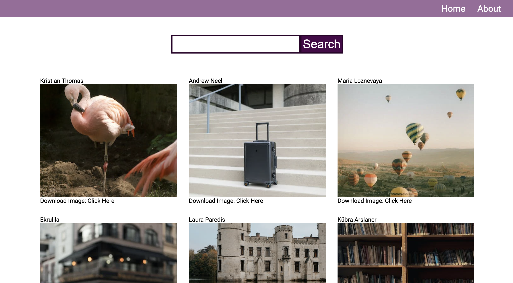

# React Photo Website - Pexels API

A photo website build with React allows you search for Pexels photos and click it to download to meet your needs.

## Getting Started

### Prerequisite

- Download [Node.js](https://nodejs.org/en/download/)
- Clone the files and use `npm init` to setup the prerequisite for this project

### Get your API Key on Pexels

Put your own [API Key](https://www.pexels.com/zh-tw/api/) in `/src/config/Keys.js`

### Run on the browser

Run the app in the development mode with `npm start`.\
Open [http://localhost:3000](http://localhost:3000) to view it in your browser.

## Learn More

Check out the live project [(Github Pages)](https://pages.github.com) by clicking [React Photo Website](/).

If you don't know how to deploy a react app to Github Pages, you can go visiting [Deploying a React App to GitHub Pages](https://github.com/gitname/react-gh-pages) , it shows you how you can create a React app and deploy it to GitHub Pages.

To learn React, check out the [React documentation](https://reactjs.org/).

Project : [2022 網頁開發全攻略(HTML, CSS, JavaScript, React, SQL, Node, more)](https://www.udemy.com/course/html5-css3-z/)
